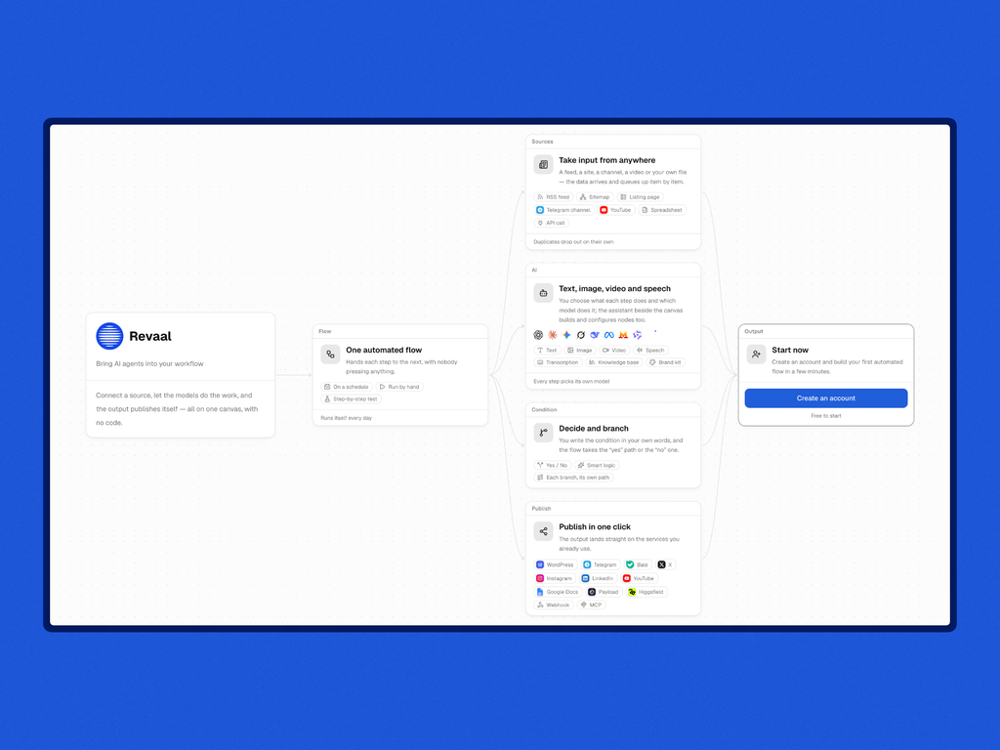
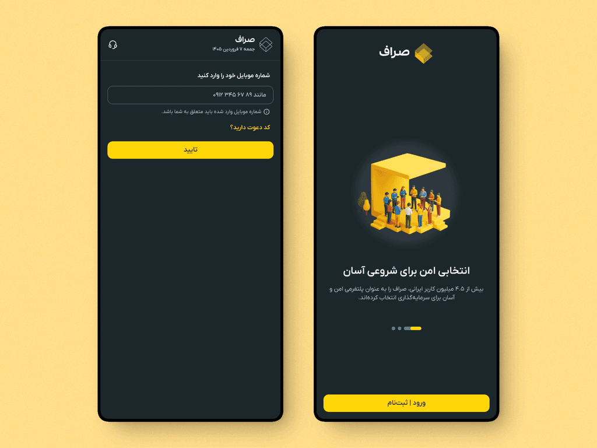
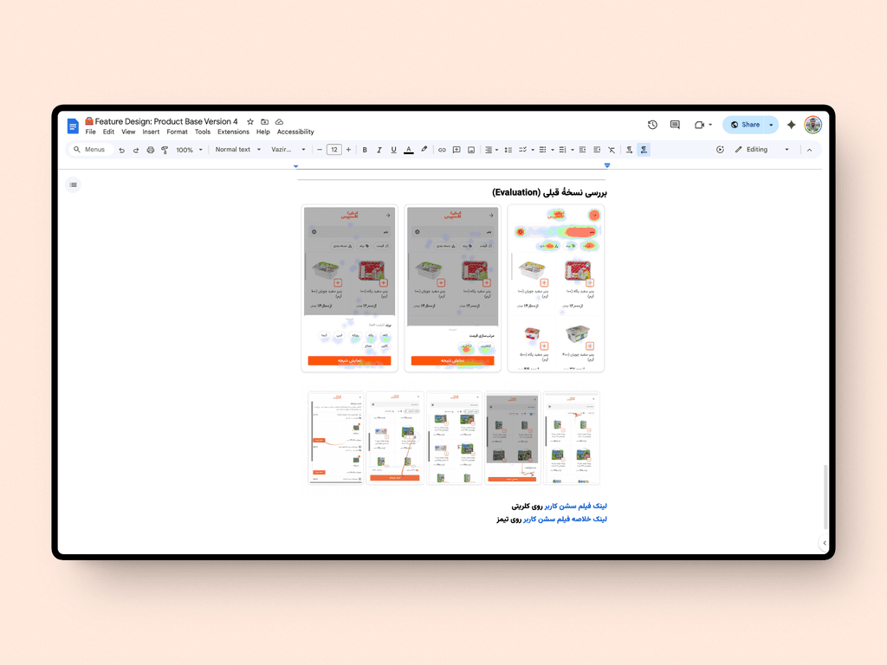
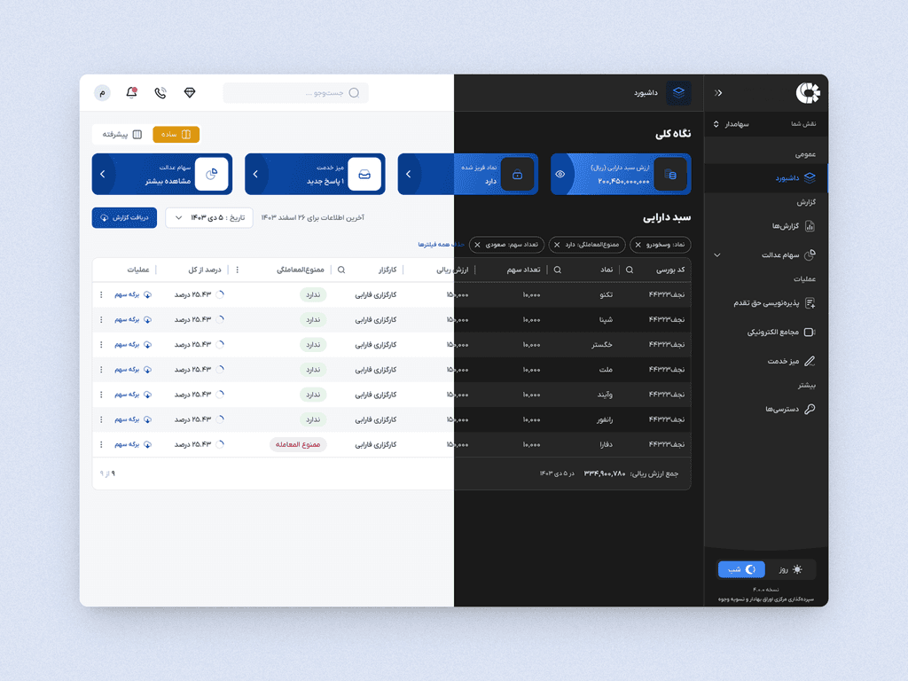
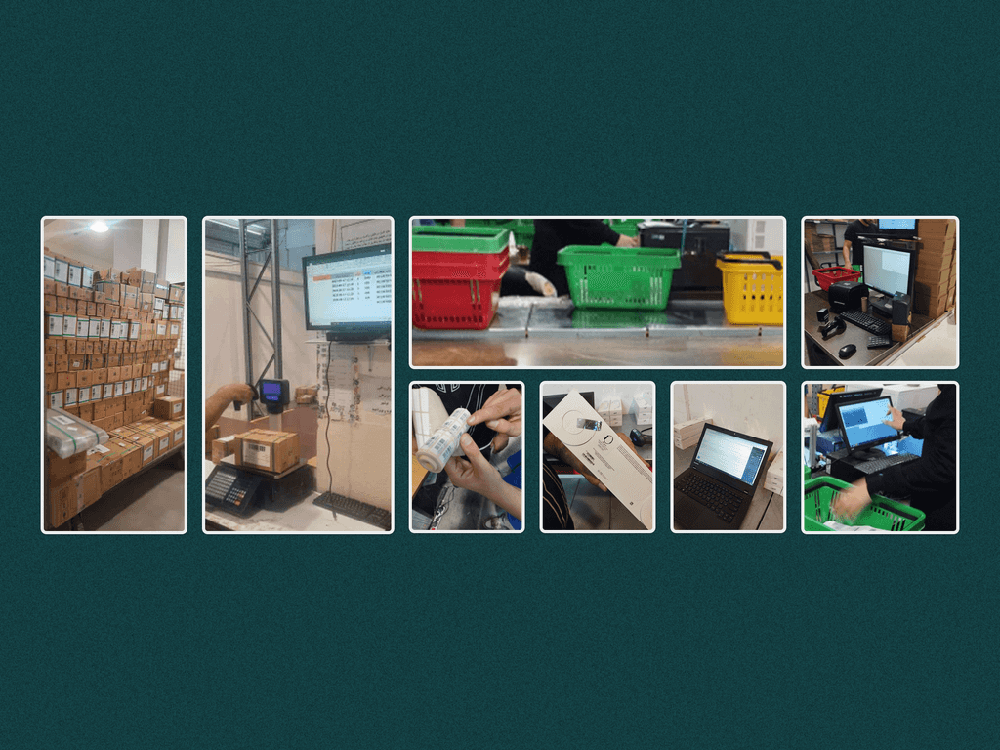
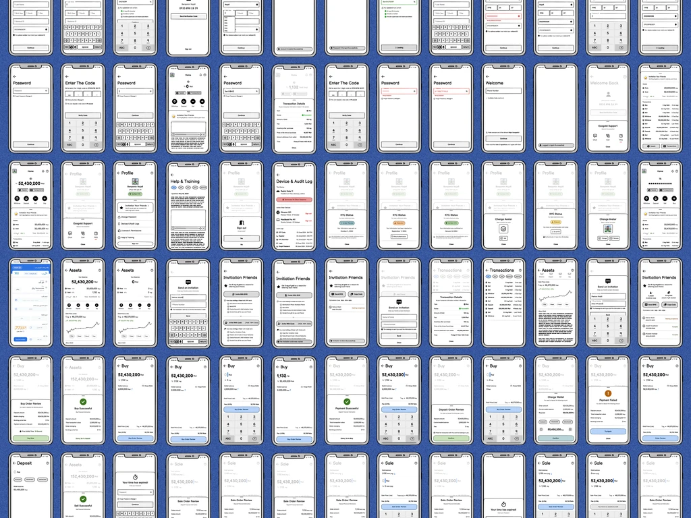

# Benyamin Najafi — Senior Product Designer

10+ years of experience leading design teams to build scalable products, from
0→1 startups to market-leading platforms. I drive product discovery and align
cross-functional teams to deliver measurable business outcomes.

**[benyaminnajafi.com](https://benyaminnajafi.com)** ·
[LinkedIn](https://www.linkedin.com/in/benyaminnajafi/) ·
[CV](https://docs.google.com/document/d/1U0G8k3SevXh0VfPRWspxLJo8dXJe-QLG2PvuZFJpFEg/edit?usp=sharing) ·
[ben.najafi@gmail.com](mailto:ben.najafi@gmail.com)

---

## Selected case studies
### From Source to Publish on One Canvas: Designing an Agentic Workflow Product

*Founding Product Designer · 0→1 & Agentic Workflow Design · AI Tooling (Editorial)*

From source to publish: **[revaal.app ⤴](https://revaal.app/)**

Revaal puts AI agents on a canvas a content team can see, wire, run and audit — connect a
source, arrange the steps, let the last step publish, no code.

- **Designed for the constraint** — Iranian sources read from inside, models called from
  outside, settlement in Toman: all three in the architecture, not a workaround.
- **Made trust a feature** — per-node token and cost accounting, an append-only audit log,
  a separate permission grant per tool.
- **Proved it on real work** — 119 sources across 16 beats, crawled, clustered and drafted
  daily for a financial news desk.

### Five Specialists Behind One Conversation: A Voice-First Investment Assistant

*Founding Product Designer · 0→1 & Conversational Design · Fintech (AI Assistant)*

Talk to the assistant: **[benan.app ⤴](https://benan.app/)**

Benan is a Persian, right-to-left investment assistant you talk to: tap the orb and a voice
agent answers out loud, or type and the same assistant replies in the chat bar.

- **Framed it around five specialties** — market analysis, live prices, news, tax, financial
  health — with the assistant routing between them rather than the user picking a tool.
- **Made voice the primary surface** — the orb is the main action on screen; the typed chat
  bar sits under it.
- **Kept the secret off the client** — the backend mints a short-lived signed URL per session,
  so the API key never reaches the browser.

### Scaling to 4.5M Users: A Data-Driven Platform Redesign

*Product Design Manager · Product Strategy · Crypto & Investment*

Spearheaded a complete platform redesign by establishing a robust, scalable
design system to ensure long-term consistency.

- **Leadership** — led a team of 7 to iterate and enhance the core product experience.
- **Continuous discovery** — targeted user needs by blending qualitative insights
  with quantitative data (Heap, Clarity, PostHog, Metabase).
- **Massive impact** — fueled hyper-growth by scaling the platform's user base
  from 700,000 to over 4.5 million.

### Redefining Grocery Discovery: The Shift to a Vendor-Less Shopping Architecture

*Product Designer · Flow & Research · FMCG (Grocery)*

Led the transition from a restrictive vendor-first model to a unified
"Product-Based" experience by analyzing quantitative funnels (Metabase) and
qualitative behaviors (Hotjar session recordings and usability tests). To reduce
interaction cost, I completely redesigned the core purchase flow — an iterative,
data-driven strategy that drastically shortened the user journey and decision time.

- Shifted user behavior by prioritizing product discovery over store selection.
- Scaled the feature from an experimental MVP to a core flow, increasing
  search-to-cart conversion.
- Established a robust foundation for a vendor-less shopping architecture
  across the platform.

### Orchestrating Delivery at Scale: A Complete Upgrade of a National Fintech Platform

*Product Design Manager · Shipping & Delivery · Fintech*

Managed the entire product development process end-to-end to ensure seamless
delivery from design to deployment. This included handing over finalized designs
to infrastructure, backend, frontend, and QA teams, and supervising the planning,
testing, and release phases. Overseeing the full workflow kept execution
efficient, high-quality, and aligned with both user needs and business objectives.

### Modernization Without Disruption: Rolling Out a Design System on a Live Operation

*Product Designer Lead · Design System & Flow · Retail*

A dual mandate: build the team and modernize the product without disrupting a
live operation.

- Assembled the product design team end-to-end — defining roles, hiring and
  onboarding, and setting rituals (crits, design reviews, async specs) that
  tightened collaboration with Product & Engineering.
- Architected a new design system (tokens, components, accessibility, content
  guidelines) with clear governance and versioning.
- De-risked change by auditing and documenting every current-state flow,
  clarifying ownership, and establishing canonical user journeys, then managing
  a phased migration with compatibility tracking and team training.

### Founding a Fintech: From Rapid Ideation to Market Launch

*Founding Product Designer · MVP Design & Planning · Fintech (Investment)*

Spearheaded the zero-to-one product and service design for a novel melted gold
trading and storage platform, navigating established market limitations and
shaping a strong go-to-market strategy.

- **Accelerated product delivery** — partnered cross-functionally with two 10x
  engineers for rapid ideation, swift decision-making, and seamless implementation.
- **Strategic market positioning** — conducted comprehensive UX audits of all
  competitors to analyze qualitative and quantitative market realities.
- **Scaled team infrastructure** — recruited and onboarded the foundational
  product and engineering team, including senior product designers and frontend
  developers.
